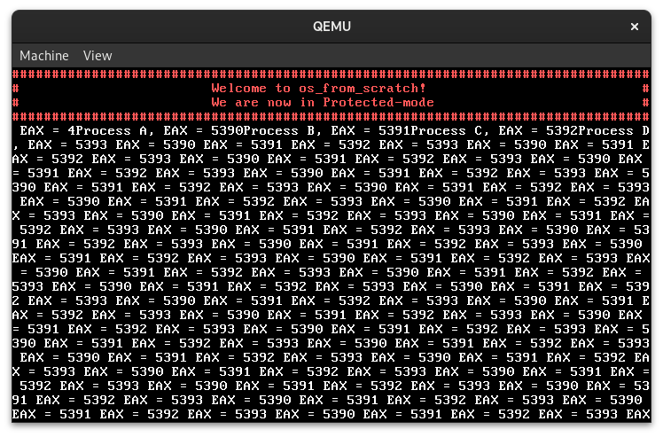

# OS From Scratch

Construction of a basic operating system inspired by 539Kernel[^1]

<p align="center">
    
</p>

## Execution

### Requirements

- [`nasm`](https://www.nasm.us/)
- [`gcc`](https://gcc.gnu.org/)
- [`python 3`](https://www.python.org/)
- GNU Utils ([`objcopy`](https://sourceware.org/binutils/docs/binutils/objcopy.html))


### Steps

#### Building Kernel

```bash
python setup.py build_kernel
```

#### Running Kernel

```bash
python setup.py run_kernel
```

[^1]: [539kernel - Mohammed Q. Hussain](https://539kernel.com/)
